# bc-agentic-mcp — Developer Onboarding Map

> One page to understand the whole system: what it is, how work flows through it,
> every tool, every wall, and the day-1 walkthrough. Everything here is verified
> against the code — file paths are real, statuses are real response fields.

---

## 1. What this is

**bc-agentic-mcp** is an MCP (Model Context Protocol) server that turns Business
Central AL development into a **gated, evidence-first lifecycle**. An AI agent (or a
human driving one) cannot skip steps: every phase produces artifacts, every claim
needs recorded evidence, and the dangerous transitions (implement, commit, PR,
merge) are guarded by **server-side walls that fire independently of model quality**.

Three design laws explain 90% of the code:

1. **Walls, not vibes** — anything that must not happen is blocked by deterministic
   code (`blocked_*` statuses), never by prompt instructions. Heuristic checks may
   *warn*, only deterministic checks may *block*.
2. **Evidence-first** — "done" means a recorded checkpoint with container-executed
   proof. A bare claim is strength-1 ("claim"); an executed test in a real BC
   container is strength-3 ("executed-test"). The verification gate demands the bar.
3. **The system learns** — every mistake becomes a `bc_reflect` lesson; recurring
   lessons get promoted into code (a new wall, a timeout entry, a generator fix).
   Unreflected mistakes **block the PR** (learn-before-ship gate).

---

## 2. Repo layout

```
bc-agentic-mcp/                     (outer folder)
├── .workspaces/                    ← SPEC STORE (external state, keyed per repo)
│   └── ERP-AL-6cc55453/            ← one key per target repo (shared by all worktrees!)
│       ├── wi267598/               ← one folder per work item (see §6)
│       ├── policy/coding_guidelines.json
│       └── .env/                   ← container preflight + install manifests
└── bc-agentic-mcp/                 (inner folder = the Python package)
    ├── src/bc_agentic_mcp/         ← server + engines (~70 modules)
    │   ├── server.py               ← tool registration, per-tool timeout index
    │   ├── workflow_policy.py      ← stage machine (plan → implement → verify → archive)
    │   ├── gate.py                 ← git commit gate (pre-commit enforcement)
    │   ├── enforcement.py          ← clarification / charter / engine checks
    │   ├── verification.py         ← evidence digest, strength tiers, path shapes
    │   ├── breaking_change.py      ← BC-BREAK-* diff scan + namespace mirror
    │   ├── dependent_build.py      ← dependent-closure compile wall
    │   ├── al_runner.py            ← container ops: sync/compile/publish/run/reinstall
    │   ├── scope.py                ← ScopeEnforcer (allowed_files, strict mode)
    │   └── tools/                  ← one handler module per MCP tool
    ├── agents/                     ← agent charters (orchestrator/refiner/reviewer/implementer)
    ├── tests/                      ← 742+ pytest tests — every wall has one
    └── docs/                       ← this file, lifecycle-map.html, diagrams
```

**Key subtlety:** the spec store is keyed by *repository*, not by worktree. All git
worktrees of ERP AL share `ERP-AL-6cc55453` — object index and lessons are shared,
which is a feature, but container install manifests are guarded per-worktree (§5).

---

## 3. Transport — how you call it

The server speaks MCP over stdio. In this workspace the proven transport is:

```powershell
& "C:\...\.venv\Scripts\python.exe" "Scripts\bc_call.py" <tool> '<json>'    # inline args
& "C:\...\.venv\Scripts\python.exe" "Scripts\bc_call.py" <tool> "@file"    # args from file
#   optional trailing args: [print-limit-chars] [deadline-seconds]
```

Operational laws (each learned the hard way, each now enforced or scripted):

- **Signature-first**: on a pydantic validation error the transport echoes
  `EXPECTED SIGNATURE — tool(...)`. Read it. Never guess parameter names.
- **Capture-then-filter**: pipe full output to `$env:TEMP\x.out.txt`, then filter
  the file. Re-invoking a tool to re-read output RE-EXECUTES it.
- The full response of the last call is always saved to
  `$env:TEMP\bc_call_last_<tool>.json`.
- **Timeouts live server-side** in `server.py::_TOOL_TIMEOUT_OVERRIDES`. Any tool
  that walks the repo or compiles has an explicit entry (bc_run_tests 2400s,
  bc_prepare_pr 1200s, bc_verify/bc_detect/bc_root_cause 600s…). If a new tool
  gains expensive work, move its budget with it — the 60s default kills it.

---

## 4. The lifecycle

```mermaid
flowchart LR
    A[intake / capture] --> B[refine]
    B --> C[root cause<br/>bugs only]
    C --> D[spec + plan]
    D --> E{{HUMAN<br/>plan approval}}
    E --> F[implement<br/>fenced writes]
    F --> G[detect + review]
    G --> H[container proof]
    H --> I[verify]
    I --> J[commit gate]
    J --> K[4 PR walls]
    K --> L[PR + tests thread]
    L --> M{{HUMAN<br/>review + merge}}
    M --> N[archive → lessons]
```



Two lanes share this shape:

- **Bugfix lane**: capture → **bc_root_cause is mandatory** (symptom, root cause with
  file:line evidence, fix approach, regression risk) → spec must include a
  bug-reproducing test (`layer='al-regression'`) → the PR description is generated
  *from* the recorded root cause.
- **PBI/feature lane**: capture/refine → spec (EARS requirements, ATs with declared
  happy/negative/edge shapes) → same gates from plan approval onward. Features
  aggregate child items (one PR per feature, reviews recorded per child).

**Human gates are physical.** `bc_request_approval` refuses to even *ask* unless the
review artifact exists and is non-empty (`blocked_artifact_missing/empty`), and its
response carries `present_to_human` — the artifact content with the instruction to
show it verbatim, never paraphrase. Implementation authorization only exists after
an `approve` decision is recorded.

---

## 5. The walls — complete enforcement inventory

Every wall returns a `blocked_*` status with a `reason` and a `next_action`. This is
the list a new developer must know (all are pytest-covered):

| Wall | Where | Blocks when |
|---|---|---|
| Scope | every `bc_implement_write/delete` | file not in the spec's `allowed_files` (strict mode) |
| Authorization | implement tools | plan not human-approved yet |
| **ID collision** | `bc_implement_write` (new files) | the object id is declared in ANY live git worktree (`git grep --untracked` across `git worktree list`) — unpushed sibling branches mint ids too |
| Fixture archaeology (warn) | `bc_implement_write` (new test codeunits) | sibling `Initialize()` majority-calls missing from the new file — arrives BEFORE first container contact |
| Presentation | `bc_request_approval` | artifact missing/unreadable/empty; success carries `present_to_human` |
| Clarifications | commit gate | any `Q-xxx` in clarifications.md unanswered / uncertain / without AL evidence |
| Commit gate | git pre-commit | no approved charter, branch↔spec mismatch, engines red |
| Env preflight | all container tools | no fresh passing `bc_env_preflight` for the container |
| `blocked_no_install` | slice test runs | no install manifest — run the full cycle first |
| `blocked_stale_install` | slice test runs | branch HEAD moved past the installed sha |
| `blocked_foreign_install` | slice test runs | container was installed from a DIFFERENT worktree — a slice would test someone else's binaries |
| Container mutex | publish cycles | cross-process lock; two publishes to one tenant abort each other |
| Verification gate | `bc_prepare_pr` | any acceptance criterion below its evidence bar (container-executed proof) |
| Reviewer freshness | `bc_prepare_pr` | newest passing `bc_review` verdict is OLDER than the last commit — it reviewed different code |
| Breaking-change scan | `bc_prepare_pr` | BC-BREAK-ENUMVAL / BC-BREAK-FIELD / BC-BREAK-TABLE vs merge-base, + the team's exact namespace rule (first line of modified non-test .al must contain `namespace Zig.`) |
| Dependent build | `bc_prepare_pr` | dependent-closure compile fails (seeds + direct dependents prioritized, never skipped) |
| Data model | `bc_prepare_pr` warns → `bc_submit_decision`/`bc_merge_status` hard-block | persisted schema changes without a second developer's `bc_approve_data_model` sign-off |
| Description standard | `bc_prepare_pr` | generated description fails the story lint — fix the GENERATOR, never hand-edit output |
| Reflection (learn-before-ship) | `bc_prepare_pr` | unreflected mistake/correction checkpoints exist — call `bc_reflect` first |
| PR thread guard | `bc_guard_pr_thread_resolution` | resolving a reviewer thread without addressing it |
| Guidelines policy | quality check | 8 regex walls from `policy/coding_guidelines.json` (TODO markers, `Find('-')`, upgrade-codeunit writes, ToolTip length…) |
| Line-ending discipline | file writer | writes match the target file's existing convention; never `\r\r\n`, no whole-file churn |
| Doom-loop | transport/runtime | identical failing call repeated — every attempt must differ |

---

## 6. Spec store anatomy (one item folder)

```
.workspaces/<REPO-KEY>/<item>/
├── charter.json           ← intent: purpose + operations in scope (approval anchors to this)
├── spec.json              ← machine spec: EARS requirements, ATs (+path_shape), objects,
│                             scope_boundaries.allowed_files (the scope wall reads this)
├── TDD.md / DESIGN.md / TASKS.md / REVIEW.md    ← human artifacts (REVIEW.md is presented at the gate)
├── clarifications.md      ← Q&A — commit gate enforces answers
├── root_cause.json        ← bugfix lane: symptom/cause/fix/risk (feeds the PR description)
├── checkpoints.jsonl      ← THE event log: phases, tests (with executed_tests), mistakes, reflections
├── TIMELINE.md / ITEM.md  ← human render of the checkpoint log
├── approvals/<phase>.md   ← human decision records
├── review_rubric.json     ← reviewer verdicts (grounding/coverage/conventions/risk, 0–1)
├── failed_approaches.jsonl← what was tried; the doom-loop reads this
├── verification.json      ← evidence digest per acceptance criterion
├── pr/PR.md + PR-TESTS.md + prepared.json      ← generated PR body + explicit test list
└── generated/             ← scaffolds (PLAN.md, test skeletons)
```

---

## 7. Tool catalog (70 tools, grouped by phase)

**Intake & refinement** — raw material → delivery-ready item
`bc_intake_start/add/analyze/graduate` (paste emails/notes, graduate to an item) ·
`bc_capture_feature` · `bc_capture_item_context` (pull the ADO item + attachments) ·
`bc_refine_feature` / `bc_refine_item` (grounded refinement: object index + BM25
precedents + wiki) · `bc_fetch_wiki` · `bc_extract_references` · `bc_mine_precedents` ·
`bc_repo_map`

**Diagnosis (bugs)** — `bc_root_cause` (mandatory before a bugfix spec)

**Spec & plan** — `bc_init` · `bc_analyze_module` · `bc_clarify` / `bc_auto_clarify` /
`bc_answer_clarification` · `bc_write_spec` · `bc_plan_design` · `bc_breakdown_tasks` ·
`bc_plan_feature` · `bc_prepare_review` / `bc_prepare_feature_review` (build REVIEW.md)

**Human gates** — `bc_request_approval` (presentation wall + `present_to_human`) ·
`bc_submit_decision` · `bc_approve_data_model` (second-developer schema sign-off)

**Implementation (fenced)** — `bc_implement_context` (prep) · `bc_implement_write`
(write+compile; scope/ID/archaeology walls) · `bc_implement_delete` (chartered
removals only, backed up) · `bc_generate_tests` · `bc_upgrade_codeunit` ·
`bc_converge` · `bc_read_code_context` (precedents; goes stale after writes — by design)

**Quality & review** — `bc_quality_check` (compiler+analyzers+guideline walls) ·
`bc_detect` (mistake detectors → reflection nudges) · `bc_review` (record findings +
rubric; findings auto-trigger reflection) · `bc_analyze_consistency` ·
`bc_check_permission_coverage` (permissions = the team's #1 review topic)

**Container proof** — `bc_env_preflight` (30s environment truth, required fresh) ·
`bc_run_tests` (full cycle `sync→compile→publish→reinstall-dependents→run`, or
guarded slice runs; records `executed_tests` with shapes) · `bc_api_contract` (live
API checks with human "validates" sentences) · `bc_record_test` · `bc_verify`
(computes the per-criterion verdict from recorded evidence)

**Ship** — `bc_prepare_pr` (ALL pre-PR walls + golden description + PR-TESTS.md) ·
`bc_create_pr` (dry-run by default; `confirm=true` creates + posts the tests thread) ·
`bc_get_review_comments` / `bc_resolve_review_comment` · `bc_guard_pr_thread_resolution` ·
`bc_merge_status` (merge-side walls) · `bc_push_items` · `bc_sync_item_state` ·
`bc_reconcile_target`

**Memory & learning** — `bc_reflect` (record lessons; clears reflection_due) ·
`bc_lessons` / `bc_promote_lesson` (durable, BM25-searchable) · `bc_feedback` ·
`bc_archive` (fires the BUG-PATTERN consolidation) · `bc_recall` · `bc_checkpoint` ·
`bc_timeline` · `bc_status` · `bc_advance` · `bc_metrics` · `bc_feature_status`

**Utilities** — `bc_health` · `bc_tool_health` · `bc_worktree` · `bc_upgrade_preflight` ·
`bc_find_consumers` · `bc_implement` (deprecated dual-behavior alias)

---

## 8. The container proof loop (acctest)

Runtime proof happens in a real BC docker container. The full cycle is one call:

```powershell
# full install cycle + run one test codeunit, with evidence recording
@{ project_root="C:\...\wt-<item>"; spec_name="wi<id>"; container_name="acctest";
   app_project_folder="C:\...\wt-<item>\extensions\TestApp";
   test_extension_id="<app guid>"; test_codeunit="66231";   # STRING, not int!
   covers="all"; validation_mode="item"; user="devadmin"
} | ConvertTo-Json | Set-Content "$env:TEMP\rt.json" -Encoding UTF8
... bc_call.py bc_run_tests "@$env:TEMP\rt.json" 6000 2500
```

- The cycle **self-heals**: `reinstall-dependents` runs before publish (restores a
  chain a sibling's base publish knocked out) and after base publishes (a dev-endpoint
  publish uninstalls dependents by design).
- Slice runs (no `app_project_folder`) are cheap but walled: no-install / stale-install /
  **foreign-install** (see §5).
- **Shared-container law**: one container, many worktrees ⇒ only ONE session may run
  container operations at a time. Two active publishers = livelock (each sees the
  other's same-version .app as poison). Serialize at the human level; the structural
  fix is a container per worktree.
- Recovery from a sibling's schema (`field X cannot be located ... Removing fields
  is not allowed`): ForceSync publish — **ask the human first**, it wipes the
  sibling's published schema.

---

## 9. Agents

Charters live in `agents/` (mirrored to `.github/agents/`):

- **bc-orchestrator** — the single strict entry point; drives the full gated
  lifecycle, never shortcuts it. All BC work starts here.
- **bc-refiner** — refinement machine: paste raw material (email, notes), get a
  delivery-ready item grounded in precedents + codebase + wiki. Never implements.
- **bc-implementer** — writes code ONLY through `bc_implement_write` within scope.
- **bc-reviewer** — independent diff screening against the Charter + BC checklist;
  records via `bc_review`. Never implements. **Cross-check its claims against the
  live tree before accepting** — external output is not evidence.

---

## 10. Day-1 walkthrough (the canonical bugfix, as actually shipped)

Bug 267598 — "rental proposal for repurchased object fails" — end to end:

1. `bc_capture_item_context` (pulls the ADO bug) → `bc_refine_item` (0 mismatches)
2. `bc_root_cause` — symptom/cause/fix recorded with file:line evidence
3. `bc_write_spec` — 3 files in `allowed_files`, 9 ATs with declared shapes
4. `bc_prepare_review` → `bc_request_approval` → REVIEW.md **presented verbatim** →
   human approves → `bc_submit_decision`
5. 3 × `bc_implement_write` (helper → report → test codeunit; every write compiles;
   `changed_file_error_count` must be 0)
6. `bc_detect` (clean) → independent review → falsify/accept each finding → `bc_review`
7. `bc_env_preflight` → `bc_run_tests` full cycle → fix fixture gaps the container
   reveals → 9/9 → regression-mode run → `bc_verify` (3/3 criteria, strict)
8. Scoped `git add` (never `-A`) → commit (gate: "approved charter + all engines
   green") → **check the numstat** (insertions ≈ file size = invisible churn)
9. Push (human approval) → `bc_prepare_pr` (4 walls + golden description from the
   recorded root cause + PR-TESTS.md) → `bc_create_pr confirm=true` → PR + explicit
   per-test comment thread
10. `bc_reflect` at every stumble along the way — the engine nags (`reflection_due`)
    until you do, and blocks the PR if you don't.

## 11. How the system learns (and how YOU should)

- `bc_detect`/`bc_review` findings and tool failures create **reflection_due signals**;
  `bc_reflect` records mistake → correction → rule. The PR is blocked while signals
  are pending.
- Recurring lessons get **promoted** (`bc_promote_lesson`) and surface in future
  refinements via BM25.
- The strongest pattern in this codebase: *when the same manual recovery happens
  twice, it becomes engine code the third time* (see `reinstall-dependents`,
  `blocked_foreign_install`, the line-ending writer, the timeout index — all born
  from live incidents, all with a test citing the incident date).

Welcome aboard. Read §5 twice — the walls are the system.
